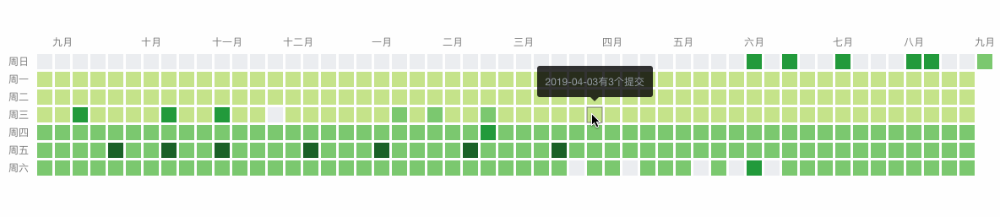
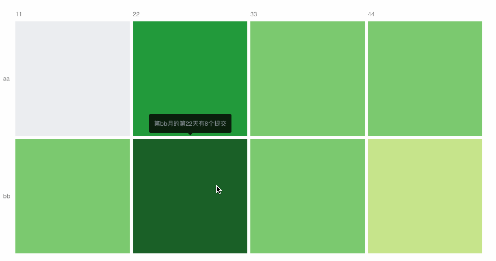

# heat-map
> **:star2:仿照git马赛克墙实现了个JS原生小工具，支持自定义日期、支持自定义横纵坐标**


- 日历型热力图


- 自定义型热力图


### 用法
使用起来很简单，只要引入css文件和js文件即可

#### 引入css和js
引入css：
```
<link rel="stylesheet" href="./heatMap.css" />
```

引入js：
```
<script src="./heatMap.js"></script>
```

#### 初始化heatMap
```
<script>
  var heatMap = new HeatMapDate()
  var option = {
    gap: 6,
    type: 'custom',
    xAxis: ['11', '22', '33', '44'],
    yAxis: ['aa', 'bb'],
    data: [
      [0, 0, 0],
      // ...
      [3, 1, 1]
    ],
    min: 0,
    max: 6,
    tip: {
      show: true,
      formatter: '第{y}月的第{x}天有{b}个提交'
    }
  }
  heatMap.setOption(option)
  heatMap.init(document.getElementById('mySvg'))
<\script>
```

### 配置参数说明
> 初始化参数方法，需传入配置参数object：
```
heatMap.setOption(option)
```

> 初始化参数热力图，需传入需要挂载的dom节点：
```
heatMap.init(dom)
```

> option参数说明

| 参数 | 说明 | 类型 | 可选值 | 默认值 |
| ------ | ------ | ------ | ------ | ------ |
| type | 热力图类型,分两种，date-日历型和custom-自定义型 | String | date/custom | date |
| xAxis | 横坐标的label,当type为custom类型时需要传递该参数 | Array | - | - |
| yAxis | 纵坐标的label,当type为custom类型时需要传递该参数 | Array | - | - |
| gap | 方格之间的间隔 | Number | - | 3 |
| data | 数据,如果type是date,那data是Object类型,格式{yyyy-MM-hh: value ...};如果type是custom,那data是Array类型,格式[[x,y,value]...] | Object/Array | - | - |
| dateStart | 当type为date类型时起作用，表示起始日期，日期格式：yyyy-MM-dd | String | - | 去年的今天 |
| rect | 方格的相关属性 | Object | - | - |
| dateEnd | 当type为date类型时起作用，表示结束日期，日期格式：yyyy-MM-dd | String | - | 今天 |
| min | 分级的最低值，默认总共五个等级 | Number | - | 0 |
| min | 分级的最高值，默认总共五个等级 | Number | - | data里头的值的最大值 |
| tip | 方格顶部鼠标悬浮小气泡的相关属性 | Object | - | - |
| tip.show | 鼠标悬浮是否显示小气泡 | Boolean | true/false | true |
| tip.formatter | 小气泡的文本内容。type为date的时候{a}表示日期，{b}表示数值；type为custom的时候表示{x}x轴对应的值，{y}y轴对应的值，{b}表示数值；如果在替换字符串前加反斜杠(例如/{b})，则不会替换该字符串 | String | - | - |
| rect | 方格的相关属性 | Object | - | - |
| rect.stroke | 方格边框的相关属性 | Object | - | - |
| rect.stroke.show | 是否显示方格边框 | Boolean | true/false | false |
| rect.stroke.background | 方格边框颜色 | String | - | #333333 |
| rect.stroke.opacity | 方格边框透明度 | Float | 0～1 | 0.6 |
| rect.colourMatching | 方格配色方案，可以自定义（custom）也可以使用现有的配色方案 | String | custom/green/pink/blue/orange/gray | green |
| rect.stroke.backgroundArr | 当type为custom类型时起作用，方格配色方案具体颜色，多少个颜色就表示多少个等级，等级由重到轻，第一个颜色表示等级最重 | Array | - | - |
